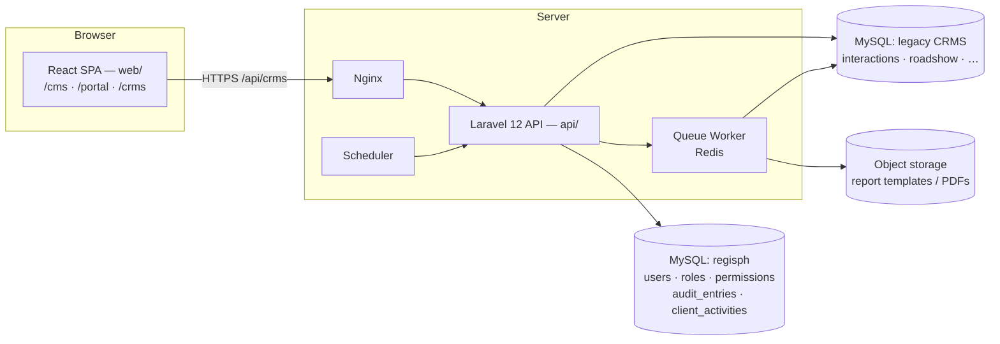

# CRMS Masterplan — Rebuilding REGIS CRMS on React + Laravel

A complete blueprint for recreating the REGIS Client Relationship Management System
(currently Angular 10 + a Node/Sequelize API + MySQL) as a **third area of the RegisPH
application that already runs this repository** — the existing Laravel API in `api/`
and the existing React SPA in `web/`, alongside `/cms` and `/portal`.

Read [Database.md](Database.md) alongside this document — it holds the full schema reference.

Two decisions frame everything below:

- **The CRMS does not send email.** Research blasts, distribution lists, and the
  outbound mail ledger already live in **CMS → Email desk** (Microsoft Graph, batched,
  logged per delivery). The CRMS neither duplicates nor replaces them (§7.6).
- **The CRMS has no accounts of its own.** It is signed into with the same CMS staff
  accounts, and only the **Administrator** and **Analyst** roles reach it (§5).

---

## 1. What the system does

REGIS CRMS is an internal system for a Philippine equity research / brokerage firm.
Its purpose is to record and evidence **research consumption** by institutional clients
(a MiFID II-style compliance requirement), and to plan the events that generate it.

Four functional pillars:

| Pillar | Purpose |
|---|---|
| **Interactions** | Log every client touchpoint (calls, meetings, roadshows) against a per-client custom form |
| **Events** | Plan Company Roadshows, Reverse Roadshows, One-Off Meetings and Analyst Marketing trips, including full travel logistics |
| **Contacts** | Master data for clients, client contacts, corporates, corporate contacts, and REGIS sell-side staff — with each client contact reconciled against its portal account (§7.6) |
| **Reporting** | Generate client-specific Excel consumption reports and branded PDF itineraries |

> **Not a pillar: research email.** The legacy Angular app carried a Research Email
> blaster, distribution lists, and an email log. None of that is rebuilt. The CMS Email
> desk owns outbound research mail end to end — local/foreign legs, saved audiences,
> Graph dispatch, and per-batch delivery records. Where the legacy CRMS tables for it
> still exist in the database, they are left untouched and read-only (Database.md §8).

---

## 2. Current vs. target stack

| Concern | Current | Target |
|---|---|---|
| Deployment shape | Standalone Angular app + its own Node API | A new `/crms` area of the existing `web/` SPA, served by the existing `api/` Laravel app |
| Frontend framework | Angular 10.0.4 (NgModule, no standalone components) | React 18 + TypeScript + Vite (the `web/` build already in place) |
| Routing | `@angular/router` | React Router v6 (data routers) |
| State / data | RxJS `BehaviorSubject` + per-component `subscribe` | TanStack Query (server state) + Zustand (UI state) |
| Forms | Template-driven + Reactive mix | React Hook Form + Zod |
| UI kit | Bootstrap 4 + ng-bootstrap + Font Awesome 4 | Tailwind CSS + shadcn/ui + lucide-react |
| Tables | jQuery DataTables via `angular-datatables` | TanStack Table |
| Select controls | `@ng-select/ng-select` | shadcn Combobox / react-select |
| Calendar | `@fullcalendar/angular` | `@fullcalendar/react` (same core, direct port) |
| Rich text | CKEditor 4 (EOL) | Not needed — the only rich-text surface was the research email; reuse `web/src/cms/kit/RichTextField.tsx` if one appears |
| Charts | `@swimlane/ngx-charts` | Recharts |
| PDF | jsPDF + jspdf-autotable (client-side) | **Server-side**: Laravel + Spatie Browsershot / DomPDF |
| Excel | ExcelJS + file-saver (client-side) | **Server-side**: `maatwebsite/excel` (PhpSpreadsheet) |
| Dates | Moment.js (legacy) | date-fns / Luxon |
| Utilities | Lodash | native ES + selective lodash-es |
| Spinner | ngx-spinner | Suspense + skeletons |
| Backend | Node + Express + Sequelize | The existing **Laravel 12 (PHP 8.2+)** API in `api/`, with a second `crms` database connection |
| Auth | Custom JWT (access + refresh) in `localStorage` | The CMS session — Sanctum tokens against the existing `users` table (§5) |
| Authorization | `roles` string + `indexOf()` checks | The CMS `roles` ⇄ `permissions` pivot, extended with `crms.*` keys, plus Policies |
| Audit | Manual `logService.createLogs()` calls from the UI | Model observers writing to the CMS `audit_entries` ledger |
| Outbound email | Research blaster inside the CRMS | **Removed** — CMS → Email desk owns it (§7.6) |
| Queue | none; the browser blocked while it worked | Laravel Queue + Jobs for PDF and Excel generation |
| DB | MySQL 8 | MySQL 8 — the legacy CRMS schema on its own connection, beside the CMS `regisph` database |
| CI/CD | Jenkins → SSH → `npm run build-preprod` | The pipeline that already ships `web/` and `api/` |

---

## 3. Target architecture



**Key architectural decisions**

1. **One application, two databases.** The CRMS is not a separate deployment. It is a
   new route area in `web/` and a new controller namespace in `api/`, reading the legacy
   CRMS schema through a second Eloquent connection. Identity, roles, and the audit
   ledger stay in the CMS `regisph` database — there is exactly one account system.
2. **Move PDF and Excel generation to the server.** Currently a 1,300-line
   `generatePDF()` runs in the browser per event list component and is duplicated
   four times. Server-side generation gives one implementation, queueable jobs,
   consistent fonts, and the ability to email the artifact without the user waiting.
3. **Move audit logging to the server.** The Angular app calls `logService.createLogs()`
   from the client after every mutation, which is unreliable and spoofable. Use model
   observers writing to `audit_entries`, the same trail the CMS already shows.
4. **Introduce a real authorization layer.** Replace `roles.indexOf('Administrator')`
   with `crms.*` permissions enforced on the API, and mirror them in the UI purely for
   affordance.
5. **Adopt the existing database as-is.** It is already attached to the new project.
   Absorb its quirks in the Eloquent layer and defer normalisation to Phase 6 (§11).
6. **Do not rebuild the research email blaster.** The CMS Email desk already sends
   research from each staff member's own mailbox through Microsoft Graph, batched and
   logged. The CRMS links out to it and stops there (§7.6).

---

## 4. Domain model & modules

### 4.1 Module map

```
Administration
├── Clients               + nested Client Addresses
├── Client Contacts       + own / watchlist / coverage team / sales
│                         + the linked portal account (§7.6)
├── Corporates            + embedded corporate contacts, 5 sector taxonomies
├── Corporate Contacts
├── Sellside Contacts     REGIS staff directory
├── Interaction Types     per-client taxonomy + meeting sub-types
├── Form Builder          per-client dynamic interaction form
└── Logs                  audit trail

Interactions              the core consumption record

Events
├── One-Off Meeting
├── Company Roadshow      Deal / Non-Deal
├── Reverse Roadshow      client visits corporates
├── Analyst Marketing     analyst travels to clients
└── Calendar              FullCalendar aggregate view

Each event has child tabs:
  Meetings · Investors · Flights · Ground Transportation · Accommodation · Regis

Reports                   Generic · Internal · By Client (6 templates)
Ticker Search             lookup a corporate → who owns / watches it
Dashboard                 interaction minutes/hours by month, most-discussed
                          stocks, reverse-roadshow demand (§7.7)
My Profile / My Activity
```

> **Dropped from the legacy module map:** *Users*, *Distribution Lists*, *Email Logs*,
> and *Research Email*. Accounts are managed in **CMS → Users & access**; audiences and
> outbound mail in **CMS → Email desk**. Sign-out and password changes are the CMS
> flows, not CRMS ones.

### 4.2 The four event types

All four share the `roadshow` table, discriminated by `category`:

| Module | Subject | Counterparty | Distinguishing fields |
|---|---|---|---|
| Company Roadshow | `corporate_id` | Clients (via Meetings) | `classification` = Deal / Non-Deal Roadshow |
| Reverse Roadshow | `client_id` | Corporates (via Meetings) | `client_contact` JSON |
| One-Off Meeting | either | either | single meeting |
| Analyst Marketing | `sellside_contact` JSON | Clients | analyst-led |

**Recommendation:** model this in Laravel with **single-table inheritance** —
one `events` table plus `CompanyRoadshow`, `ReverseRoadshow`, `OneOffMeeting`,
`AnalystMarketing` Eloquent models using a global scope on `category`. This preserves
the data shape while giving each type its own validation rules and PDF renderer.

### 4.3 Meeting classification

Within an event, each meeting carries `corporate_type`:

- `client` — meeting with a client firm (used by Company Roadshow, Analyst Marketing)
- `corporate` — meeting with an issuer (used by Reverse Roadshow)
- `expert_meeting` — free-text expert / site visit

Validation rules differ per value; this is currently a chain of `if/alert()` calls
in each form component and should become a Form Request rule set.

### 4.4 Meeting → Interaction conversion

A meeting row can be promoted into an `interaction`. The Angular app does this by
stuffing the meeting into `localStorage` and navigating to `/interaction/add?form=roadshow&eventID=X`.

**Rebuild as:** `POST /api/meetings/{id}/convert-to-interaction` returning the new
interaction, with the client navigating to it. No `localStorage` handoff.

---

## 5. Access, roles & permissions

### 5.1 The CRMS has no account system

The legacy CRMS kept its own `user` table, its own roles string, and its own login.
**None of that is carried forward.** The CRMS is signed into with the **CMS staff
accounts** already in `regisph.users` (`kind = 'staff'`), through the same Sanctum
token issuance the CMS uses.

The legacy `user` table stays in the database, untouched and read-only, only so that
historical `interactions.user_id` and `log.user_id` values still resolve to a name
(Database.md §8).

| Legacy CRMS role | Replaced by |
|---|---|
| `Administrator` | CMS role **Administrator** |
| `Contributor`, `Maintenance`, `Report`, `Guest` | CMS role **Analyst** |

Only **Administrator** and **Analyst** reach `/crms`. The **Editor** role is a site-content
role and is deliberately excluded — an Editor signing in is bounced from `/crms` the same
way a client is bounced from `/cms`.

### 5.2 Target permission set

The CMS already models permissions as a `roles` ⇄ `permissions` pivot with 1:1
permission keys per module (`insights.manage`, `email.manage`, `access.manage`, …).
The CRMS extends that same table — **no new authorization package**. Add one group:

| Key | Label | Group |
|---|---|---|
| `crms.access` | CRMS sign-in | CRMS |
| `crms.interactions.manage` | Interactions | CRMS |
| `crms.events.manage` | Events & itineraries | CRMS |
| `crms.contacts.manage` | Clients & corporates | CRMS |
| `crms.reports.generate` | Consumption reports | CRMS |
| `crms.admin` | Interaction types, form builder, CRMS logs | CRMS |

Grants, seeded in `RbacSeeder` beside the existing ones:

| Role | Grants |
|---|---|
| **Administrator** | Every key — it is a system role and always holds the full set |
| **Analyst** | `crms.access`, `crms.interactions.manage`, `crms.events.manage`, `crms.contacts.manage`, `crms.reports.generate` |
| **Editor** | none |

Read-only viewing is expressed by *withholding* the `manage` key while keeping
`crms.access`, which replaces the legacy `Guest` role without a new role.

### 5.3 Enforcement

- `POST /api/crms/login` authenticates a staff account and **refuses any account that
  does not hold `crms.access`**, is suspended, or is `kind = 'client'`.
- Every `/api/crms/*` route is wrapped in `auth:sanctum` + `staff` +
  `permission:{key}` — the same middleware stack the CMS routes already use.
- The `/crms` React area is gated by `RequireAuth` + `RequirePermission`, exactly as
  `/cms` routes are in [web/src/App.tsx](web/src/App.tsx). The UI gate is affordance
  only; the API is the authority.
- `GET /api/me` already returns the signed-in staff member's permission keys, so the
  CRMS shell needs no second identity call.

---

## 6. API design

Replace the legacy RPC-style endpoints with REST, namespaced under `/api/crms` so they
sit beside the existing `/api/cms` and `/api/portal` surfaces. Legacy → target mapping:

| Legacy | Target |
|---|---|
| `GET /api/{entity}/all` | `GET /api/crms/{entities}` (paginated, filterable) |
| `GET /api/{entity}/find/{id}` | `GET /api/crms/{entities}/{id}` |
| `POST /api/{entity}/add` | `POST /api/crms/{entities}` |
| `POST /api/{entity}/update` | `PUT /api/crms/{entities}/{id}` |
| `POST /api/{entity}/delete` | `DELETE /api/crms/{entities}/{id}` |
| `GET /api/{child}/getItemsByID/{id}` | `GET /api/crms/events/{id}/{children}` |
| `GET /api/interaction/getByDateRange/{a}&{b}` | `GET /api/crms/interactions?from=&to=` |
| `GET /api/interaction/getByYear/{y}` | `GET /api/crms/interactions?year=` |
| `GET /api/roadshow/getByYear/{y}` | `GET /api/crms/events?category=roadshow&year=` |
| `GET /api/client_address/getAddressByClient/{id}` | `GET /api/crms/clients/{id}/addresses` |
| `GET /api/form/getByFirmID/{id}` | `GET /api/crms/clients/{id}/form` |
| `GET /api/{contact}/findByEmail/{email}` | `GET /api/crms/{contacts}?email=` |
| `GET /api/log/getByMonthYear/{y}/{m}` | `GET /api/crms/logs?year=&month=` |
| `POST /api/user/login` | `POST /api/crms/login` (CMS staff account, §5.3) |
| `POST /api/user/refresh-token` | — removed; Sanctum tokens, same as the CMS |
| `GET /api/user/current-user` | `GET /api/me` (already exists) |
| `POST /api/user/forgotPassword` | — CMS flow |
| `POST /api/user/resetPassword` | — CMS flow |
| `POST /api/user/updatePassword` | — CMS flow |
| `POST /api/sendmail`, `…/runOnBehalf`, `…/sendEmailAsUser` | — **not rebuilt**; `POST /api/cms/email-blasts/{id}/send` already covers it |

### New endpoints to add

```
POST /api/crms/events/{id}/pdf              queue PDF generation → job id / download url
POST /api/crms/events/{id}/pdf/email        generate + mail the itinerary to the requester
GET  /api/crms/events/{id}/pdf?contact_id=  itinerary filtered to one client contact
POST /api/crms/reports/generate             { type, client_id?, from, to } → xlsx
POST /api/crms/meetings/{id}/convert-to-interaction
GET  /api/crms/corporates/{id}/holders      ticker search: who owns / watches
GET  /api/crms/dashboard/summary
GET  /api/crms/client-contacts/{id}/portal  linked portal account + consumption (§7.6)
POST /api/crms/client-contacts/{id}/portal  link or unlink the portal account
GET  /api/crms/clients/{id}/portal-accounts portal users whose firm maps to this client
```

### Response conventions

The legacy API returns `200 OK` with `{ status: 500, message: "..." }` in the body for
errors — every component in the Angular app checks `if (response.status == 500)`.
**Do not carry this forward.** Use real HTTP status codes and Laravel API Resources:

```json
// success
{ "data": { ... }, "meta": { ... } }

// validation error — 422
{ "message": "The given data was invalid.", "errors": { "field": ["..."] } }
```

---

## 7. Feature specifications to preserve

These behaviours are non-obvious and easy to lose in a rewrite. Each one exists in the
current system and is depended upon by users.

### 7.1 Interactions
- Interaction ID is **zero-padded to 10 digits** in all UI and exports.
- The form rendered is the one attached to the selected client (`form.client_id`);
  falls back to a default form when the client has none.
- Interaction Types are filtered by client, and each type carries a newline-delimited
  list of allowed `meeting_type` sub-values.
- Attendee lists are stored as snapshots — see Database.md §4.
- **Every interaction is saved, full stop** — it is the evidence the firm gets paid on.
  What varies is what happens *after* the save:
  - **Save and close** — the default. The interaction is recorded and the analyst
    returns to the list.
  - **Save and send to recipients** — for an interaction the analyst flags as
    actionable (sales can move on it immediately). Saving does not compose an email
    itself; it hands the saved interaction to the CMS Email desk composer
    (`/cms/email`, ad-hoc blast, pre-filled with the interaction summary) so the send
    goes out through the same Graph pipeline and delivery log as every other CMS
    email, rather than a second send path living inside the CRMS.
  - `POST /api/crms/interactions` accepts `disposition: 'closed' | 'flagged'`; a
    flagged interaction carries an `actioned_at` timestamp once the CMS composer is
    opened for it, so the interactions list can show which flags are still open.

### 7.2 Event PDF itinerary
Every event type produces the same branded A4 portrait PDF:

1. **Cover page** — background image, event title, subject name (35pt), date range.
2. **Participants** — `INVESTORS` block (client + contacts with office/email),
   then `REGIS` block (staff from the `bank` table).
3. **Summary Schedule** — meetings grouped by date, sorted by date + start time.
4. **Detailed Schedule** — flights, ground transport, accommodation and meetings
   merged into one chronological stream, grouped by date, each with a section header
   band and optional `NOTE:` row.
5. **Every page footer** — `Primary Coordinator: {name}`, contact line, generation
   timestamp, page N of M, and the REGIS logo top-right from page 2 onward.

**Accommodation prints on every day it covers, not only the day of check-in.** The
legacy PDF shows a hotel booking once, at the start of the trip, leaving later days
silent about where the traveller is staying. `ScheduleAggregator` must expand each
`accommodation` row across its full `date`→`date_out` span so the Detailed Schedule
carries a lodging line on every date in range — the point is that a client or corporate
can read any single day of the itinerary and know the full schedule for that day,
including where the party is sleeping.

Filename: `{Type} Schedule - {Subject} ({DD MMM YYYY hh:mm}).pdf`

Three delivery modes per event: **download**, **email to self**, and
**download filtered to a single client contact** (only meetings that contact attends).

The email variant sends an HTML summary of the same schedule as the body, with the
PDF attached. This is a one-to-one transactional mail through Laravel's mailer to the
requesting staff member — it is *not* a blast and does not touch the CMS Email desk,
its audiences, or `email_blasts`.

### 7.3 Reports
Three report types: **Generic**, **Internal**, **By Client**. "By Client" branches on
`client.id` to pick one of six Excel templates — see Database.md §6. Templates live in
`src/assets/excelTemplate/` today; move them to server storage and drive the mapping
from a `report_templates` table.

Report cells are populated from `interactions.form` by `internalName` lookup, so the
Form Builder and the report mapping are coupled — document that contract explicitly.

**Bugs to fix, not port** — these are the reason the rebuild exists, so they are
acceptance criteria, not nice-to-haves:

- **Missing rows by author.** The Internal report's "analysts" sheet is currently
  empty while the "sales" sheet is not, even though both roles log interactions. The
  legacy query filters by author role using a value that no longer matches every
  analyst account. `ReportGenerator` must select every `interactions` row in range
  regardless of the author's role, and a report-generation test must assert both
  sheets are populated from a fixture with mixed authors.
- **Date range is not honoured.** Filtering a By Client report (Schroders, JPMorgan,
  etc.) to a month currently returns every interaction with that client since 2020.
  `from`/`to` must be applied as a real `WHERE interaction_date BETWEEN` clause before
  the template is populated, and the acceptance test for this feature is: generate a
  one-month Schroders report and confirm the row count matches
  `interactions()->whereBetween(...)->count()` exactly.
- Both fixes apply to **every** report type and every client template, since they
  share one `ReportGenerator` code path (§8.1) — there is exactly one place to fix
  this, not six.

### 7.4 Ticker Search
Given a corporate, find every client contact whose `own` or `watchlist` JSON contains
that corporate. Today this is a client-side scan over all contacts. After
normalisation this becomes a single indexed query.

### 7.5 Calendar
FullCalendar aggregating roadshows, reverse roadshows, meetings and analyst marketing.
Clicking an entry navigates to the event form with `?form=calendar`, so Cancel returns
to the calendar rather than the list. Preserve this return-path behaviour.

### 7.6 Portal accounts inside Client Contacts

The same institutional individual exists twice today: as a `client_contact` row in the
CRMS, and as a portal account in `regisph.users` (`kind = 'client'`) provisioned through
**CMS → Users & access**. The CRMS is where the two are reconciled.

**The link.** Add a nullable `portal_user_id` to `client_contact` (additive, safe under
§11.5). It is resolved once, then stored:

1. **Auto-suggest on exact email match**, case-insensitive — the only rule that may link
   without a human. Everything else is a *suggestion*, never an automatic write.
2. **Suggest by firm** — `users.firm` fuzzy-matched against `client.name` and
   `client.monikers`, offered as a shortlist on the client contact form.
3. **Manual link / unlink**, always available, always written to `audit_entries`.

**What the CRMS reads from the portal account** — read-only, resolved live so it can
never drift, never written back:

| Portal field (`regisph.users`) | Where it surfaces in the CRMS |
|---|---|
| `email`, `phone`, `position` | Client Contact detail — shown beside the CRMS-held values, with a mismatch flagged rather than silently overwritten |
| `firm` | Reconciled against the parent `client.name`; a mismatch is flagged |
| `username` | Client Contact detail — the Regis-issued sign-in id |
| `client_type` (`Local` / `Foreign`) | Client Contact badge; also a filter on the contacts list |
| `sector_prefs`, `preferred_analysts` | Coverage panel — what this contact is provisioned to read |
| `status`, `suspended`, `last_active_at` | Account chip: Invited · Awaiting approval · Approved · Declined · Suspended, plus last sign-in |
| `client_activities` (portal ledger) | **Consumption** tab on the client contact and on the client — report views, downloads, and clicks, listed alongside logged interactions |

**Rules.**

- **The CMS is the system of record for portal identity.** The CRMS never creates,
  approves, suspends, or edits a portal account, and never writes to `users` or
  `client_activities`. Where an edit is needed the UI deep-links to
  `/cms/access` rather than duplicating the form.
- **Never overwrite a compliance snapshot.** `interactions.client_contact` and the event
  attendee JSON stay exactly as saved (Database.md §4). Portal detail is decoration on
  the *current* record only — a reprinted itinerary still shows the historic values.
- **Unlinked is a first-class state.** Not every client contact has a portal account, and
  not every portal account maps to a contact. Both directions surface as a short
  reconciliation list on the Clients screen: *contacts with no portal account* and
  *portal accounts with no contact*.
- **Cross-database, so no FK.** The two schemas are separate connections; `portal_user_id`
  is an unconstrained integer resolved in the application layer, and a deleted portal
  account degrades to "account no longer exists" rather than erroring.

**Why it is worth the wiring:** the portal ledger is *evidenced* consumption —
hash-chained, tamper-evident, and already collected. Putting it next to the manually
logged interactions on one screen means the analyst sees the full picture of what a
client actually read before they log the call about it.

### 7.7 Dashboard summary

Two summary blocks, both aggregated server-side from data the CRMS already logs —
`GET /api/crms/dashboard/summary` returns both in one call, filterable by month range:

- **Interaction load.** Minutes/hours of logged client contact per month, computed
  from `interaction_date` + `duration` (or `time_end - time_start` where `duration` is
  blank), grouped by month and, on request, by client. Alongside it, the stocks most
  discussed — a count of `interactions.form` entries whose `internalName` is
  `stock1`–`stock5` (Database.md §5), ranked over the selected window.
- **Reverse-roadshow demand.** For `roadshow` rows where `category` is Reverse
  Roadshow: (a) the corporates/stocks most requested, counted from the meetings
  attached to those events, and (b) for each of those corporates, which clients asked
  to meet them — a corporate → client fan-out, not just a flat count, since a coverage
  or sales conversation needs the names, not only the number.

Both blocks are read-only aggregations; nothing here writes back to `interactions` or
`roadshow`.

### 7.8 Sector taxonomy & the research distribution list

The client-facing requirement is a **research distribution list**: every client
contact tagged to the sectors (and, within a sector, the specific tickers) whose
research they want to receive, organised under a **Domestic / Foreign** split that
mirrors the CMS's existing `client_type` (Local / Foreign).

The CMS already carries half of this — `users.sector_prefs` is a flat list of sector
names (Database.md, `regisph.users`). What the client is asking for is one level more
specific: a fixed, editable hierarchy of **sector → member tickers**, e.g.

```
Domestic
├── Banks              BPI · BDO · MBT · SECB
├── Property            ALI · SMPH · FLI · MEG · RLC · VLL
├── Power & Utilities    ACEN · AP · FGEN · MWC · MER · SCC
├── Telecommunications  CNVRG · GLO · TEL
├── Consumer            CNPF · EMI · JFC · MONDE · PGOLD · RRHI · FB · SEVN · PIZZA · URC · WLCON
├── Gaming & Leisure    BLOOM
├── Mining              NIKL
├── Conglomerates       AGI · AC · DMC · GTCAP · LTG · SM
└── Transportation      CEB · ICT
Foreign
└── (the same sector list, held as a separate selection per client)
```

**Where this lives.**

- The **hierarchy itself** — sector names and their member tickers — is CRMS-owned
  configuration, editable by an Administrator, because the tickers are drawn from
  `corporate` (a CRMS table) and the taxonomy changes as coverage changes. Model it as
  `crms.sector_group` (`id`, `name`, `scope: domestic|foreign`, `position`) and
  `crms.sector_group_corporate` (pivot to `corporate.id`) — additive tables on the
  `crms` connection (§11.5), editable from **CRMS → Client Contacts → Distribution
  list**.
- **Which client contact is subscribed to which sector** is what actually drives a
  send, so it is read by the CMS Email desk when it matches recipients to a report
  (`GET /api/cms/email-blasts/match?report=`, already keyed on sector + analyst
  preference). The CRMS writes a client contact's sector selection to the *existing*
  `regisph.users.sector_prefs` for a linked portal account (§7.6) — through the CMS
  `/cms/access` account editor, not a direct write from the CRMS, keeping the CMS the
  system of record for anything that drives an outbound send. A client contact with no
  linked portal account can still record sector/ticker preferences locally on
  `client_contact` for reference, flagged as "not wired to a send" until it is linked.
- **Sending research to the list** is unchanged from the earlier decision in this
  document: the CMS Email desk sends it (§7.6, "Not a pillar: research email"). The
  CRMS's job stops at maintaining the taxonomy and each contact's place in it.

This keeps exactly one send path (Graph, batched, logged) while giving the desk the
ticker-level list they described, instead of rebuilding a second blaster around it.

---

## 8. Project structure

### 8.1 Backend — inside the existing `api/`

Nothing here is a new application. Every path is relative to `api/`, and the CRMS
namespace keeps the legacy schema quarantined from the CMS models already in `app/Models`.

```
app/
├── Casts/
│   └── LegacyTime.php                     {"hour":..,"minute":..} ⇄ "HH:mm"
├── Console/Commands/
│   ├── CrmsSchemaDrift.php
│   ├── CrmsLinkPortalAccounts.php         email-match backfill for §7.6
│   └── Backfill/                          Phase 6 normalisation backfills
├── Enums/Crms/
│   ├── EventCategory.php                  Roadshow | ReverseRoadshow | Meeting | AnalystMarketing
│   ├── MeetingClassification.php          client | corporate | expert_meeting
│   └── RoadshowClassification.php         Deal | NonDeal
├── Http/Controllers/Crms/
│   ├── LoginController.php                staff token issuance, gated on crms.access
│   ├── ClientController.php               ClientAddressController.php
│   ├── ClientContactController.php        ClientContactPortalController.php  (§7.6)
│   ├── CorporateController.php            CorporateContactController.php
│   ├── SellsideContactController.php
│   ├── InteractionController.php          InteractionTypeController.php
│   ├── FormController.php
│   ├── EventController.php                MeetingController.php
│   ├── InvestorController.php             FlightController.php
│   ├── TransportationController.php       AccommodationController.php
│   ├── EventAttendeeController.php        CalendarController.php
│   ├── ReportController.php               TickerSearchController.php
│   ├── DashboardController.php            ActivityLogController.php
├── Http/Requests/Crms/                    one Form Request per write action
├── Http/Resources/Crms/                   one API Resource per model
├── Models/Crms/                           every model sets $connection = 'crms'
│   ├── Client.php  ClientAddress.php  ClientContact.php
│   ├── Corporate.php  CorporateContact.php  SellsideContact.php
│   ├── Interaction.php  InteractionType.php  Form.php
│   ├── Event.php  (+ CompanyRoadshow, ReverseRoadshow, OneOffMeeting, AnalystMarketing)
│   ├── Meeting.php  Investor.php  Flight.php  Transportation.php
│   ├── Accommodation.php  EventAttendee.php  CalendarEvent.php
│   └── ReportTemplate.php
├── Policies/Crms/
├── Services/Crms/
│   ├── Pdf/
│   │   ├── ItineraryPdfBuilder.php        shared layout engine
│   │   ├── CompanyRoadshowPdf.php
│   │   ├── ReverseRoadshowPdf.php
│   │   └── AnalystMarketingPdf.php
│   ├── Reports/
│   │   ├── ReportGenerator.php            resolves template by client
│   │   ├── GenericReport.php
│   │   ├── InternalReport.php
│   │   └── Templates/{Gmo,JpMorgan,Schroders,TRowe,Corpaxe}Report.php
│   ├── PortalAccountResolver.php          client_contact ⇄ users bridge (§7.6)
│   └── ScheduleAggregator.php             merges meetings+flights+transpo+hotel
├── Jobs/
│   ├── GenerateItineraryPdf.php
│   └── GenerateClientReport.php
└── Observers/Crms/                        writes audit_entries
config/database.php                        + the 'crms' connection
database/
├── migrations/     additive + index-only on the crms connection (§11.5)
├── seeders/RbacSeeder.php                 + the crms.* permissions and grants (§5.2)
└── seeders/CrmsReportTemplateSeeder.php
resources/views/crms/
├── pdf/            Blade templates for Browsershot
└── mail/           the itinerary mail body — transactional only (§7.2)
routes/api.php                             + the /api/crms group
tests/{Feature,Unit}/Crms/
```

> There is no `Services/Mail/GraphMailer`, no `SendResearchBlast` job, no
> `DistributionList` or `EmailLog` model. The CMS already owns all of it —
> see `app/Jobs/SendEmailBlast.php` and `resources/views/email/blast.blade.php`.

### 8.2 Frontend — inside the existing `web/`

A third area beside `web/src/cms` and `web/src/portal`, lazy-loaded so it stays out of
the public bundle.

```
src/crms/
├── CRMSLayout.tsx                 shell, sidebar, header, breadcrumbs
├── store.tsx                      bootstrap collections, mirroring cms/store.tsx
├── data.ts                        wire types shared across modules
├── api/                           typed endpoint modules over lib/api.ts
├── kit/                           DataTable, TimePicker, SaveBar, pickers
└── modules/
    ├── Dashboard.tsx
    ├── InteractionsModule.tsx
    │   └── interactions/          DynamicForm, AttendeePicker, list
    ├── EventsModule.tsx
    │   └── events/                EventFormShell + one config per type,
    │                             EventChildTab, Calendar
    ├── ClientsModule.tsx
    │   └── clients/               addresses, contacts, PortalAccountPanel (§7.6),
    │                             ConsumptionTab, reconciliation list
    ├── CorporatesModule.tsx
    ├── SellsideModule.tsx
    ├── FormBuilderModule.tsx
    ├── ReportsModule.tsx
    ├── TickerSearchModule.tsx
    └── LogsModule.tsx
```

Sign-in reuses [web/src/pages/LoginCRMS.tsx](web/src/pages/LoginCRMS.tsx) and the shared
`PortalAuth` component; the session, `RequireAuth`, and `RequirePermission` all come from
`web/src/cms/auth.tsx` unchanged. There is no `research-email`, `distribution-lists`, or
`email-logs` module — those are `web/src/cms/modules/EmailModule.tsx`.

**The single highest-value refactor:** the four event forms
(`roadshow-form`, `reverse-roadshow-form`, `analyst-marketing-form`,
`meeting-form`) are each ~2,000 lines of near-identical code, as are the four list
components with their duplicated 1,300-line `generatePDF()`. In React, build:

- one `<EventFormShell>` driven by a per-type config object, and
- one `<EventChildTab>` generic component parameterised by resource + columns + modal form.

This collapses roughly **12,000 lines into under 2,000**.

---

## 9. Cross-cutting implementation notes

### 9.1 Authentication
There is nothing new to build. The CRMS uses the **Sanctum bearer token the CMS already
issues**, stored and refreshed by `web/src/cms/auth.tsx`, and reads identity and
permission keys from the existing `GET /api/me`. That removes the `localStorage` JWT,
the manual refresh-token interceptor, and the client-side base64 decode currently used
to read `roles`.

`POST /api/crms/login` exists only to give the CRMS its own sign-in page and its own
refusal message; it authenticates the same `users` row and rejects anything without
`crms.access` (§5.3). A staff member already signed into `/cms` is already signed into
`/crms`.

### 9.2 Data tables
Every list screen currently uses jQuery DataTables with `dom: 'Bfrtip'`, buttons
`New Record | colvis | print | excel | pageLength`, page sizes `10/25/50/All`, and a
leading trash-icon column. Reproduce this as one `<DataTable>` component:

- column visibility toolbar (`colvis`)
- CSV/Excel export
- print view
- page size selector including "Show all"
- row actions column
- server-side pagination, sorting and search (a change from today's client-side
  approach — necessary, as several tables load every row up front)

### 9.3 Time handling
The existing columns hold `{"hour":H,"minute":M,"second":S}` JSON strings. Do **not**
convert them in the database. Handle it entirely in the model layer with a custom cast
(§11.3) so the API speaks `HH:mm` while the stored format stays byte-compatible with the
legacy Angular app during parallel running.

Introduce a `TimePicker` on the frontend that emits and consumes `HH:mm` only.

Timezones are stored as free-text labels (`MNL`, `HKT`) and are display-only — keep
them as strings, do not attempt tz-aware conversion, or existing itineraries will shift.

### 9.4 Error handling & UX
Replace every `alert()` and `confirm()` (there are hundreds) with toast notifications
and a confirmation dialog component. Replace `ngx-spinner` full-screen blocking with
per-query loading states and optimistic updates.

### 9.5 Security fixes to make during the rebuild
- Enforce authorization **on the server** — currently a `Guest` can reach any endpoint.
- Retire the legacy `user` table as a login surface; it becomes read-only history (§5.1).
- Remove the client-side JWT decode as a source of truth for roles.
- Rate-limit `POST /api/crms/login`, as the CMS login already is.
- Treat the portal bridge as read-only: no `/api/crms/*` route may write to `users`,
  `client_activities`, or `audit_entries` beyond appending its own audit row.
- The DataTables `render` callbacks build HTML with unescaped record fields —
  in React, never use `dangerouslySetInnerHTML` for record data.
- Move all secrets out of `environment.*.ts` into server-side config.

---

## 10. Delivery roadmap

> **Starting point:** the existing production database is already attached to the new
> project. The roadmap below therefore builds *on top of* the live schema rather than
> migrating into a new one — see §11 for the adoption strategy.

### Phase 0 — Foundation
- Add the `crms` database connection to the existing `api/` app; **no schema migration**.
- Add the `/crms` route area to `web/`, reusing the CMS session and layout primitives.
- Generate baseline models from the live schema, then map table/column names by hand (§11.2).
- Extend `RbacSeeder` with the `crms.*` permissions and the Administrator / Analyst
  grants (§5.2); wire `POST /api/crms/login` and the `permission:` middleware.
- Additive-only migrations on the `crms` connection: `report_templates`,
  `client_contact.portal_user_id`, plus the missing indexes (§11.5).
- Write the read-only schema-drift test (§11.6) before any feature work.
- CI: lint, typecheck, PHPUnit, Vitest — the pipeline that already covers `api/` and `web/`.

### Phase 1 — Master data
- Clients, Client Addresses, Client Contacts.
- Corporates, Corporate Contacts, Sellside Contacts.
- The portal-account bridge (§7.6): email-match backfill command, link/unlink,
  the account panel, and the two reconciliation lists.
- Generic `<DataTable>` + generic CRUD form patterns established here.

### Phase 2 — Interactions
- Interaction Types, Form Builder, dynamic form renderer.
- Interaction list + create/edit, attendee pickers, snapshot persistence.
- Audit logging via observers into `audit_entries`; Logs screen.
- Consumption tab: portal `client_activities` shown beside logged interactions.

### Phase 3 — Events
- Event shell + the four types.
- Child tabs: Meetings, Investors, Flights, Transportation, Accommodation, Regis.
- Meeting → Interaction conversion.
- Calendar view.

### Phase 4 — Output
- Server-side itinerary PDF (all three delivery modes).
- Excel reports: Generic, Internal, and the six client templates.
- `report_templates` configuration UI.

### Phase 5 — Cutover
- Dashboard, Ticker Search, My Activity, Help.
- Parallel run: both apps against the same database. Generate a PDF and an Excel report
  from each for the same records and diff them — this is the acceptance test.
- Cutover, freeze the Angular app read-only, decommission.

### Phase 6 — Post-cutover cleanup (optional, no longer user-facing)
- Normalise the JSON columns behind the already-stable API (§11.4).
- Drop the redundant `created` column and the `archive_*` tables.
- Retire the legacy Node API and the legacy `user` table.

---

## 11. Working with the existing database

The production database is already in place in the new project. **Do not rewrite the
schema up front.** Adopt it as-is, absorb its quirks in the model layer, and normalise
later — after the API surface is stable and the Angular app is retired.

This gives you three things a big-bang migration cannot: the two apps can run in
parallel against one database during the rebuild, there is no cutover data-loss window,
and the compliance-critical `interactions` rows are never rewritten.

### 11.1 Rules of engagement

| Rule | Why |
|---|---|
| No renames, no drops, no type changes while the Angular app is live | Both apps share the database during Phases 1–5 |
| New tables and nullable columns are additive only | `report_templates`, `client_contact.portal_user_id` |
| Index-only migrations are safe | Non-breaking, immediate performance win |
| All legacy shape is absorbed by Eloquent, not SQL | Casts, accessors, `$connection`/`$table`/`$primaryKey` overrides |
| Nothing in the CMS `regisph` database is altered for the CRMS | The bridge reads `users` and `client_activities`; it never writes them |
| Structural change waits for Phase 6 | After the legacy app is decommissioned |

### 11.2 Map Eloquent onto the legacy tables

Laravel's conventions do not match this schema. Declare the mapping explicitly on each
model rather than renaming anything.

```php
class Interaction extends Model
{
    protected $connection = 'crms';
    protected $table = 'interactions';

    // legacy `created` column is redundant; Laravel manages created_at/updated_at
    public const CREATED_AT = 'created_at';
    public const UPDATED_AT = 'updated_at';

    protected $casts = [
        'interaction_date' => 'date',
        'time_start'       => LegacyTime::class,   // §11.3
        'time_end'         => LegacyTime::class,
        'form'             => 'array',             // TEXT holding JSON
        'client_contact'   => 'array',
        'sellside_contact' => 'array',
    ];

    public function type()
    {
        return $this->belongsTo(InteractionType::class, 'interactions_type_id');
    }
}
```

Every CRMS model sets `$connection = 'crms'`. Put it on a shared `CrmsModel` base class
so it cannot be forgotten — a model that silently falls back to the default connection
would query the CMS database.

Non-obvious mappings to declare:

| Model | `$table` | Notes |
|---|---|---|
| `Client` | `client` | singular |
| `ClientContact` | `client_contact` | carries `portal_user_id` → `regisph.users` (§7.6) |
| `Corporate` | `corporate` | |
| `CorporateContact` | `corporate_contact` | **no FK to `corporate`** — see §11.4 |
| `SellsideContact` | `sellside_contact` | |
| `InteractionType` | `interactionsType` | camelCase table name |
| `Event` | `roadshow` | STI parent, `category` discriminator |
| `Transportation` | `transpo` | |
| `EventAttendee` | `bank` | legacy name, UI label is "Regis" |
| `CalendarEvent` | `event` | distinct from the `roadshow` STI models |
| `ActivityLog` | `log` | plus `archive_log`; read-only history once observers write `audit_entries` |

No model is written for `user`, `distribution_list`, `email_log`, or `archive_email_log`.
The first is replaced by the CMS `users` table, the rest by the CMS Email desk
(Database.md §8).

For the four event types, use single-table inheritance on `roadshow.category`:

```php
class CompanyRoadshow extends Event
{
    protected static function booted(): void
    {
        static::addGlobalScope('category', fn ($q) => $q->where('category', EventCategory::Roadshow->value));
        static::creating(fn ($m) => $m->category = EventCategory::Roadshow->value);
    }
}
```

> Confirm the `category` integer used by Analyst Marketing against the legacy Node API
> before writing its scope — `event_category` only seeds 1–3 (Database.md §3.5).

### 11.3 Absorb the legacy formats with casts

One cast handles every time column (`time_start`, `time_end`, `time`, `time_in`,
`time_out`, `time_arrival`) across all tables:

```php
class LegacyTime implements CastsAttributes
{
    // stored as {"hour":13,"minute":30,"second":0}; exposed as "13:30"
    public function get($model, string $key, $value, array $attributes): ?string
    {
        if (blank($value)) {
            return null;
        }
        $t = json_decode($value, true);
        return is_array($t) && isset($t['hour'])
            ? sprintf('%02d:%02d', $t['hour'], $t['minute'] ?? 0)
            : null;
    }

    public function set($model, string $key, $value, array $attributes): ?string
    {
        if (blank($value)) {
            return null;
        }
        [$h, $m] = array_pad(explode(':', $value), 2, 0);
        return json_encode(['hour' => (int) $h, 'minute' => (int) $m, 'second' => 0]);
    }
}
```

The same approach covers the JSON-in-TEXT attendee columns via `'array'` casts. Write
**one** hardening test per cast against real production values — these columns contain
empty strings, `null`, `'null'`, and malformed rows.

### 11.4 Deferred normalisation (Phase 6)

Once the API is the only writer, normalise incrementally. For each JSON column in
Database.md §4, follow the expand/contract pattern:

1. **Expand** — add the pivot table alongside the JSON column.
2. **Backfill** — one-off command populates the pivot from the JSON.
3. **Dual-write** — the model writes both for one release; a scheduled job reconciles drift.
4. **Switch reads** — queries move to the pivot; the JSON column is now write-only.
5. **Contract** — drop the column, *except* on `interactions`, `meetings`, `roadshow`,
   `investor` and `event`, where the JSON is a deliberate historical snapshot and must
   be retained (Database.md §4).

Highest-value first:

| Order | Column | Unlocks |
|---|---|---|
| 1 | `client_contact.own` / `.watchlist` | Indexed Ticker Search instead of a full-table client-side scan |
| 2 | `corporate.corporate_contacts` | Real FK on `corporate_contact.corporate_id` |
| 3 | `client_contact.coverage_team` / `.sales` | Coverage reporting |
| 4 | `interactions.*` attendees | Consumption analytics — **keep the snapshot JSON** |

### 11.5 Safe changes you can make immediately

These are additive or index-only and will not break the running Angular app:

```php
// Missing indexes on the hot query paths
$table->index(['client_id', 'interaction_date'], 'interactions_client_date_idx');
$table->index(['roadshow_id', 'date'],           'meeting_roadshow_date_idx');
$table->index('email',                           'client_contact_email_idx');
$table->index('ticker',                          'corporate_ticker_idx');
$table->index(['category', 'start_date'],        'roadshow_category_start_idx');
```

Also safe now:
- New tables: `report_templates`.
- A **nullable** `client_contact.portal_user_id` for the portal bridge (§7.6), plus
  `$table->index('portal_user_id')`. Unconstrained — the target lives in another
  database. The legacy app ignores unknown columns.
- A **nullable** `corporate_id` on `corporate_contact` — populate it during Phase 6
  step 2.

Nothing needs to be added for auth: `personal_access_tokens`, `roles`, `permissions`,
and `permission_role` already exist in the CMS database and are reused as-is.

Deferred until the legacy app is gone: dropping the legacy `user` table, dropping
`created`, and folding the `archive_*` tables in.

### 11.6 Guardrails

- **Schema-drift test.** A PHPUnit test asserting the exact column list of every legacy
  table. It fails the build if anyone adds a stray migration that mutates the shared schema.
- **Connection guard.** A test asserting every model under `App\Models\Crms` reports
  `crms` as its connection, and that no CRMS controller writes to a CMS table other than
  `audit_entries`.
- **Backups before every deploy** for as long as both apps share the database.
- **Separate DB user for the new API** during parallel running, so you can revoke or
  restrict it independently and attribute writes in the slow query log.
- **Reconciliation check** after each phase: row counts per table plus a checksum of
  `interactions` grouped by `client_id` and year — the compliance-critical set. Nothing
  the new API does should change historical counts.
- **Output parity.** Regenerate 20 sampled itinerary PDFs and one report per client
  template from both apps against the same rows; diff before cutover.

---

## 12. Testing strategy

| Layer | Tooling | Coverage focus |
|---|---|---|
| Backend unit | PHPUnit / Pest | `LegacyTime` / JSON casts against real production values, `ScheduleAggregator` ordering, PDF section assembly, report cell mapping, `PortalAccountResolver` matching rules |
| Backend feature | PHPUnit against a dedicated test database (never the shared one) | Every endpoint × every role — Administrator allowed, Analyst allowed, **Editor and client refused**, suspended refused; validation rules per meeting classification |
| Schema guard | PHPUnit | Column list of every legacy table is unchanged; every CRMS model is on the `crms` connection (§11.6) |
| Frontend unit | Vitest + Testing Library | Dynamic form renderer, data table behaviours, permission gating, portal-account panel states (linked / unlinked / account deleted) |
| E2E | Playwright | Sign in as an Analyst → create event → add all six child types → download PDF; create interaction from a per-client form; generate a client report; link a client contact to a portal account and read its consumption |
| Regression | Golden-file diffs | PDF and XLSX byte/structure comparison against legacy output |

---

## 13. Known issues in the current system to fix, not port

| Issue | Location | Fix |
|---|---|---|
| Authorization is client-side only | `AuthGuardService`, `auth.isRoles()` | Server policies on `crms.*` permissions |
| A second account system to provision and de-provision | `user` table, Users module | The CMS `users` table and **CMS → Users & access** (§5) |
| Client details kept twice, drifting between CRMS and portal | `client_contact` vs. portal accounts | The `portal_user_id` bridge with mismatch flagging (§7.6) |
| `{status: 500}` inside HTTP 200 | every service | Real status codes |
| ~12,000 lines of duplicated event form/list/PDF code | `components/event/**` | Shared shell + config |
| `localStorage` used to pass a meeting into the interaction form | roadshow forms | Server-side convert endpoint |
| Hard-coded client IDs (10, 23, 59, 72, 126, 139) | `reports.component.ts` | `report_templates` table |
| Hard-coded group emails `research@regis.ph`, `sales@regis.ph` | sellside sorting | Flag on `sellside_contact` |
| A second research-email blaster, with its own audiences and log | `research-email`, `distribution_list`, `email_log` | **Not rebuilt** — CMS → Email desk (§7.6) |
| CKEditor 4 (end-of-life) | research email | Removed with the module; the CMS composer uses `RichTextField` |
| Moment.js (deprecated) | everywhere | date-fns |
| `loadsh: 0.0.4` typo dependency alongside lodash | `package.json` | Remove |
| Node 10.24.1 engine pin | `package.json` | Current LTS |
| Full-table client-side loads (`/all`) | every list | Server-side pagination |
| Audit logs written by the client | `logService` | Model observers |
| No unique index on `user.email` | schema | Moot — the legacy `user` table is no longer a login surface (§5.1) |

---

## 14. Quick-reference: legacy route → new route

| Angular route | React route |
|---|---|
| `/` | `/crms` (dashboard) |
| `/interaction`, `/interaction/add`, `/interaction/:id` | `/crms/interactions`, `/crms/interactions/new`, `/crms/interactions/:id` |
| `/meeting`, `/meeting/:id` | `/crms/events/meetings`, `/crms/events/meetings/:id` |
| `/roadshow`, `/roadshow/:id` | `/crms/events/roadshows`, `/crms/events/roadshows/:id` |
| `/reverseroadshow`, `/reverseroadshow/:id` | `/crms/events/reverse-roadshows`, `/crms/events/reverse-roadshows/:id` |
| `/analystmarketing`, `/analystmarketing/:id` | `/crms/events/analyst-marketing`, `/crms/events/analyst-marketing/:id` |
| `/calendar` | `/crms/events/calendar` |
| `/client`, `/client/:id` | `/crms/clients`, `/crms/clients/:id` |
| `/clientcontact`, `/client_contact` | `/crms/client-contacts` |
| `/corporate`, `/corporatecontact` | `/crms/corporates`, `/crms/corporate-contacts` |
| `/sellsidecontact` | `/crms/sellside-contacts` |
| `/interactiontype` | `/crms/interaction-types` |
| `/formbuilder`, `/formbuilder/:id` | `/crms/form-builder`, `/crms/form-builder/:id` |
| `/report` | `/crms/reports` |
| `/ticker_search` | `/crms/ticker-search` |
| `/log`, `/activity` | `/crms/logs`, `/crms/my-activity` |
| `/user`, `/user/:id` | — `/cms/access` (CMS → Users & access) |
| `/distributionlist`, `/emaillog`, `/email` | — `/cms/email` (CMS → Email desk) |
| `/myprofile`, `/changepassword` | — the CMS profile and password flows |
| `/login`, `/forgotpassword`, `/resetpassword` | `/login/crms`; recovery is the CMS flow |

---

## 15. Source requirements (client email) and where each lands

The client's own requirements email, condensed to what each item asks for and a pointer
to where this document commits to it. Kept here so nothing in the email gets lost in
translation, and so a reviewer can check the plan against the ask line by line.

| # | The ask | Where it lands |
|---|---|---|
| 1 | Dashboard should show interaction minutes/hours per client by month and the stocks most discussed, plus a reverse-roadshow summary of the corporates most requested and which clients requested them | §7.7 Dashboard summary |
| 2 | Every interaction must be saved (it is how the firm evidences billing), with an option to save-and-close or save-and-send-to-recipients for actionable interactions | §7.1 Interactions |
| 3 | The client-interaction log format (date, type, description, attendees) | §7.1 Interactions, Database.md `interactions` |
| 4 | Meetings with clients and companies (abroad, local, virtual) are logged automatically as Events, with child tabs for Meetings, Flight, Ground Transportation, and Accommodation — accommodation should print on every day of the trip, not just the first | §4.2, §7.2 Event PDF itinerary |
| 5 | Meetings distinguish two classifications — corporate meetings (auto-filled from the corporate record) and expert meetings (typed manually) | §4.3 Meeting classification |
| 6 | Every event carries a Regis contact (name, position, contact details) so the counterparty knows who to call | §7.2 Event PDF itinerary, `bank` / `EventAttendee` |
| 7 | Client Contacts need a "Research distribution list" tagging each contact to a sector of interest, under an editable Domestic/Foreign hierarchy with ticker-level detail per sector | §7.8 Sector taxonomy & the research distribution list |
| 8 | Clients (company/firm records) are their own database | §4.1 Module map — Clients; Database.md `client` |
| 9 | Reports must generate all interactions in a date range to Excel; today the Internal report's analyst sheet comes back empty, and client-specific report date filters (Schroders, JPMorgan, …) are ignored, returning years of history instead of the requested range | §7.3 Reports — bugs to fix |
| 10 | Research is emailed to clients via two bodies with different links and distribution lists, following the sector hierarchy in item 7 | Not a CRMS feature — **CMS → Email desk** already sends this (local/foreign legs, saved audiences, Graph dispatch); §7.8 wires the sector/ticker taxonomy into the same recipient matching the Email desk already does. No second blaster is built in the CRMS (§1, §7.6) |
