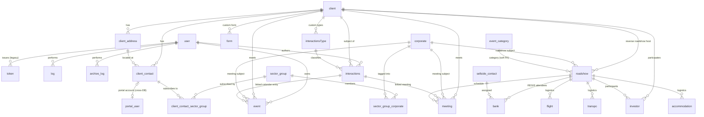

# CRMS — Database Schema Reference

Source of truth: `crms_latest_0810_2026.sql` (MySQL 8, InnoDB, `utf8mb4` / `utf8mb4_0900_ai_ci`).

This document describes the **existing production schema** of the REGIS CRMS (Client Relationship
Management System) so it can be recreated, migrated, or re-modelled on a new stack.

**Two areas of this schema are deliberately not rebuilt** — see §8:

- `user` / `token` — the CRMS no longer has its own accounts. Sign-in uses the CMS
  `regisph.users` table (CRMSmasterplan.md §5).
- `distribution_list`, `email_log`, `archive_email_log` — the CRMS no longer sends email.
  The CMS Email desk owns research blasts, audiences, and delivery records.

The rows stay in place as history; nothing reads or writes them.

---

## 1. Conventions used by the legacy schema

| Convention | Detail |
|---|---|
| Primary key | `id INT AUTO_INCREMENT` on every table |
| Timestamps | `created_at DATETIME NOT NULL`, `updated_at DATETIME NOT NULL` |
| Legacy timestamp | An extra `created DATETIME NULL` column exists on most tables (Sequelize legacy artifact, effectively redundant with `created_at`) |
| Foreign keys | `<entity>_id` naming, `ON UPDATE CASCADE`, with `ON DELETE SET NULL` or `ON DELETE CASCADE` depending on the relation |
| Denormalised JSON | Many relationship-style columns are stored as **JSON encoded into a `TEXT` column** rather than as join tables (see §4). This is the single biggest technical debt in the schema. |
| Time-of-day | Stored as a **JSON string** `{"hour":13,"minute":30,"second":0}` in `VARCHAR`/`TEXT` columns (ng-bootstrap timepicker format), not as SQL `TIME` |
| Dates | `DATETIME`, used as date-only in most modules |

---

## 2. Entity Relationship Diagram



`portal_user` above is `regisph.users` where `kind = 'client'` — a different database, so
the link is an unconstrained `client_contact.portal_user_id` resolved in the application
layer (§9).

`distribution_list`, `email_log`, and `archive_email_log` are absent from the diagram:
nothing relates to them any more (§8).

---

## 3. Table reference

### 3.1 Identity & Security

> **Retired as a login surface.** `user` and `token` are no longer authenticated against.
> The CRMS signs in with the CMS `regisph.users` table, restricted to the Administrator
> and Analyst roles (CRMSmasterplan.md §5). `user` is kept read-only so that historical
> `interactions.user_id`, `log.user_id`, and `event.user_id` still resolve to a name.

#### `user`
Application users (REGIS staff). **Legacy — read-only.**

| Column | Type | Notes |
|---|---|---|
| `id` | int PK | |
| `first_name` | varchar(255) NULL | |
| `last_name` | varchar(255) NULL | |
| `email` | varchar(255) NULL | Former login identifier. Never made UNIQUE; now moot. |
| `password` | varchar(255) NULL | Hash — no longer checked |
| `type` | varchar(255) NULL | Free-text user type |
| `roles` | text NULL | **Comma/JSON list of role names.** Values in use: `Administrator`, `Contributor`, `Guest`, `Maintenance`, `Report`. Superseded by the CMS role grants. |
| `reset_link` | text NULL | Password-reset token — dead |
| `status` | varchar(255) NULL | e.g. active / inactive |
| `created`, `created_at`, `updated_at` | datetime | |

#### `token`
Refresh-token store for the legacy JWT auth. **Dead** — replaced by Sanctum
`personal_access_tokens` in the CMS database.

| Column | Type | Notes |
|---|---|---|
| `id` | int PK | |
| `token` | text NOT NULL | Refresh token value |
| `user_id` | int NULL → `user.id` | `ON DELETE SET NULL` |
| `created_at`, `updated_at` | datetime | |

#### `log` / `archive_log`
Audit trail. `archive_log` is a historical roll-off copy with identical columns.

| Column | Type | Notes |
|---|---|---|
| `id` | int PK | |
| `activity` | varchar(255) NOT NULL | e.g. `"Deleted client contact"` |
| `payload` | text NULL | JSON snapshot of the affected record |
| `user_id` | int NULL → `user.id` | `ON DELETE SET NULL` |
| `created`, `created_at`, `updated_at` | datetime | |

---

### 3.2 Buy-side (Clients)

#### `client`
Institutional investor firms.

| Column | Type | Notes |
|---|---|---|
| `id` | int PK | |
| `name` | varchar(255) NOT NULL | |
| `region` | varchar(255) NULL | Used in client-specific Excel reports |
| `monikers` | varchar(255) NULL | Alternate names / aliases |
| `client_type` | text NULL | Classification |
| `created`, `created_at`, `updated_at` | datetime | |

#### `client_address`
Multiple office addresses per client.

| Column | Type | Notes |
|---|---|---|
| `id` | int PK | |
| `name` | text NULL | Full address text |
| `client_id` | int NULL → `client.id` | `ON DELETE SET NULL` |

#### `client_contact`
Individuals at a client firm.

| Column | Type | Notes |
|---|---|---|
| `id` | int PK | |
| `firstname`, `lastname` | varchar(255) NULL | UI concatenates into a display name |
| `email` | varchar(255) NULL | |
| `contact_no`, `mobile_no` | varchar(255) NULL | |
| `position` | varchar(255) NULL | |
| `country` | varchar(255) NULL | |
| `own` | text NULL | **JSON array of corporates held** — `[{id,name,ticker,identifiers1,identifiers2}]` |
| `watchlist` | text NULL | **JSON array of corporates watched** — same shape as `own` |
| `coverage_team` | text NULL | **JSON array** `[{id,name,...}]` of `sellside_contact` |
| `sales` | text NULL | **JSON array** — main sales / research contact(s) |
| `distribution_list` | varchar(255) NULL | Legacy blaster membership. **Unused** — audiences now live in the CMS (§3.6). |
| `assistant` | varchar(255) NULL | |
| `assistant_email` | varchar(255) NULL | |
| `assistant_contact_no` | varchar(255) NULL | |
| `client_id` | int NOT NULL → `client.id` | `ON DELETE CASCADE` |
| `client_address_id` | int NULL → `client_address.id` | `ON DELETE SET NULL` |
| `portal_user_id` | int NULL | **Added.** → `regisph.users.id` where `kind = 'client'`. Cross-database, so no FK constraint; indexed and resolved in the application layer (§9). |

---

### 3.3 Sell-side & Corporates

#### `sellside_contact`
REGIS analysts / sales staff who appear on schedules and email signatures.

| Column | Type | Notes |
|---|---|---|
| `id` | int PK | |
| `name` | varchar(255) NOT NULL | |
| `email` | varchar(255) NOT NULL | Matched against the logged-in user's email in the email module |
| `type` | varchar(255) NULL | e.g. Research / Sales |
| `position` | varchar(255) NULL | |
| `office_no`, `mobile_no` | varchar(255) NULL | |

> Two special group mailboxes are hard-coded in the UI and sorted to the top:
> `research@regis.ph` and `sales@regis.ph`.

#### `corporate`
Listed companies / issuers.

| Column | Type | Notes |
|---|---|---|
| `id` | int PK | |
| `name` | varchar(255) NOT NULL | |
| `ticker` | varchar(255) NULL | e.g. `WLCON` |
| `identifiers1` | varchar(255) NULL | Bloomberg-style, e.g. `WLCON PM` |
| `identifiers2` | varchar(255) NULL | Reuters-style, e.g. `WLCON.PS` |
| `address` | text NULL | Default meeting address |
| `corporate_contacts` | text NULL | **JSON array of embedded contacts** (denormalised duplicate of `corporate_contact`) |
| `sector_generic` | varchar(255) NULL | Sector taxonomy — generic |
| `sector_gmo` | varchar(255) NULL | Client-specific sector mapping (GMO) |
| `sector_jpmorgan` | varchar(255) NULL | Client-specific sector mapping (JPMorgan) |
| `sector_schroders` | varchar(255) NULL | Client-specific sector mapping (Schroders) |
| `sector_trowe` | varchar(255) NULL | Client-specific sector mapping (T. Rowe Price) |

#### `corporate_contact`
Master list of issuer-side individuals (IR officers, CFOs, etc.).

| Column | Type | Notes |
|---|---|---|
| `id` | int PK | |
| `name` | varchar(255) NOT NULL | |
| `position` | varchar(255) NULL | |
| `address` | varchar(255) NULL | |
| `email`, `mobile`, `phone` | varchar(255) NULL | |
| `assistant`, `assistant_email` | varchar(255) NULL | |
| `analyst` | text NULL | **JSON array** of covering analysts |

> ⚠️ No FK to `corporate`. The linkage lives inside `corporate.corporate_contacts` (JSON).

---

### 3.4 Interactions (core MiFID II consumption record)

#### `interactions`
The central record of every touchpoint with a client.

| Column | Type | Notes |
|---|---|---|
| `id` | int PK | Displayed zero-padded to 10 digits in the UI |
| `interaction_date` | datetime NOT NULL | |
| `time_start`, `time_end` | varchar(255) NULL | JSON `{hour,minute,second}` |
| `duration` | varchar(255) NULL | |
| `meeting_type` | varchar(255) NULL | Sub-type of the interaction type |
| `description` | text NULL | |
| `internal_notes` | text NULL | |
| `action_point` | text NULL | |
| `recipients` | text NULL | |
| `client_contact` | text NULL | **JSON array** of `client_contact` snapshots |
| `sellside_contact` | text NULL | **JSON array** of `sellside_contact` snapshots |
| `client_contact_status` | varchar(255) NULL | |
| `form` | text NULL | **JSON snapshot of the dynamic form** (see `form.fields`) — the per-client custom fields and their captured values |
| `client_id` | int NOT NULL → `client.id` | `ON DELETE CASCADE` |
| `user_id` | int NULL → `user.id` | `ON DELETE SET NULL` |
| `interactions_type_id` | int NULL → `interactionsType.id` | `ON DELETE SET NULL` |
| `disposition` | varchar(255) NULL | **Added.** `closed` (default) or `flagged` — save-and-close vs. save-and-send-to-recipients (CRMSmasterplan.md §7.1) |
| `actioned_at` | datetime NULL | **Added.** Set once a flagged interaction has been handed to the CMS Email desk composer |

#### `interactionsType`
Per-client configurable interaction taxonomy.

| Column | Type | Notes |
|---|---|---|
| `id` | int PK | |
| `type` | text NOT NULL | e.g. `Conference Call` |
| `meeting_type` | text NULL | Newline-delimited list of allowed sub-types |
| `client_id` | int NULL → `client.id` | `ON DELETE SET NULL` (NULL = global type) |

#### `form`
Form-builder definitions — one dynamic form per client.

| Column | Type | Notes |
|---|---|---|
| `id` | int PK | |
| `fields` | text NOT NULL | **JSON array of `FieldSchema`** (see §5) |
| `client_id` | int NULL → `client.id` | `ON DELETE SET NULL` |

---

### 3.5 Events & Logistics

#### `event_category`
Seeded lookup for the `roadshow.category` discriminator.

| id | name |
|---|---|
| 1 | Roadshow |
| 2 | Reverse Roadshow |
| 3 | Meeting |

> The Analyst Marketing module reuses the same `roadshow` table (via the
> `/api/analystmarketing/*` endpoints) and is distinguished by its own `category`
> value together with a populated `sellside_contact` column. Confirm the exact
> integer against the backend when migrating.

#### `roadshow`
The **parent event record** for all four event modules (Company Roadshow, Reverse Roadshow,
One-Off Meeting, Analyst Marketing). The `category` column is the discriminator.

| Column | Type | Notes |
|---|---|---|
| `id` | int PK | |
| `category` | int NOT NULL | → `event_category.id` (no FK constraint) |
| `classification` | varchar(255) NULL | Company Roadshow only: `Deal Roadshow` / `Non-Deal Roadshow` |
| `start_date` | datetime NOT NULL | |
| `end_date` | datetime NULL | |
| `coordinator` | varchar(255) NULL | Primary coordinator name |
| `tel_no`, `mobile_no`, `email` | varchar(255) NULL | Coordinator contact details (printed in PDF footer) |
| `corporate_id` | int NULL → `corporate.id` | Subject of a Company Roadshow |
| `client_id` | int NULL → `client.id` | Host of a Reverse Roadshow |
| `client_contact` | text NULL | **JSON array** of participating client contacts |
| `sellside_contact` | text NULL | **JSON array** — analysts, used by Analyst Marketing |

#### `meeting`
Individual meeting slots inside an event.

| Column | Type | Notes |
|---|---|---|
| `id` | int PK | |
| `date` | datetime NOT NULL | |
| `time_start`, `time_end` | varchar(255) NOT NULL | JSON `{hour,minute,second}` |
| `timezone` | varchar(255) NULL | Free text, e.g. `MNL`, `HKT` |
| `location` | varchar(255) NOT NULL | |
| `meeting_type` | varchar(255) NOT NULL | e.g. `Group meeting`, `Site visit` |
| `corporate_type` | varchar(255) NULL | Meeting classification: `client` \| `corporate` \| `expert_meeting` |
| `description` | text NULL | Address / free text for expert meetings |
| `contact` | text NULL | Attendees description |
| `booked_by` | text NULL | |
| `note` | text NULL | |
| `corporate_address` | text NULL | |
| `client_contact` | text NULL | **JSON array** |
| `corporate_contact` | text NULL | **JSON array** |
| `roadshow_id` | int NOT NULL → `roadshow.id` | |
| `client_id` | int NULL → `client.id` | |
| `corporate_id` | int NULL → `corporate.id` | |
| `interaction_id` | int NULL → `interactions.id` | Set when the meeting is converted into an interaction |

#### `investor`
Client firms + contacts attending an event.

| Column | Type | Notes |
|---|---|---|
| `id` | int PK | |
| `client_contact` | text NULL | **JSON array** of client contact snapshots |
| `client_id` | int NULL → `client.id` | `ON DELETE SET NULL` |
| `roadshow_id` | int NOT NULL → `roadshow.id` | |

#### `flight`
Air travel legs for an event.

| Column | Type | Notes |
|---|---|---|
| `id` | int PK | |
| `date` | datetime NOT NULL | Departure date |
| `time` | varchar(255) NOT NULL | Departure time — JSON `{hour,minute,second}` |
| `location` | varchar(255) NOT NULL | Departure airport |
| `description` | text NULL | Flight number / details |
| `timezone` | varchar(255) NULL | |
| `date_arrival` | datetime NULL | |
| `time_arrival` | varchar(255) NULL | JSON time |
| `timezone_arrival` | varchar(255) NULL | |
| `location_arrival` | varchar(255) NULL | |
| `description_arrival` | text NULL | |
| `passenger` | text NULL | Newline-delimited passenger list |
| `note` | text NULL | |
| `roadshow_id` | int NOT NULL → `roadshow.id` | |

#### `transpo`
Ground transportation bookings.

| Column | Type | Notes |
|---|---|---|
| `id` | int PK | |
| `date` | datetime NOT NULL | |
| `start_time`, `end_time` | varchar(255) NOT NULL | JSON time |
| `timezone` | varchar(255) NULL | |
| `location` | varchar(255) NOT NULL | |
| `description` | text NULL | |
| `driver_name` | varchar(255) NOT NULL | |
| `driver_mobile` | varchar(255) NOT NULL | |
| `vehicle_type` | varchar(255) NOT NULL | |
| `confirm_no` | varchar(255) NOT NULL | |
| `remarks` | text NULL | |
| `passenger` | text NULL | |
| `note` | text NULL | |
| `roadshow_id` | int NOT NULL → `roadshow.id` | |

#### `accommodation`
Hotel bookings.

| Column | Type | Notes |
|---|---|---|
| `id` | int PK | |
| `date` | datetime NOT NULL | Check-in |
| `time_in` | text NULL | JSON time |
| `date_out` | datetime NULL | Check-out |
| `time_out` | text NULL | JSON time |
| `location` | varchar(255) NULL | |
| `description` | text NULL | Hotel name / address |
| `accommodator` | text NULL | Guest list |
| `note` | text NULL | |
| `roadshow_id` | int NOT NULL → `roadshow.id` | |

#### `bank`
REGIS ("sell-side bank") staff attending an event. Table name is a legacy artifact
from a Deutsche Bank-derived template; the UI labels it **"Regis"**.

| Column | Type | Notes |
|---|---|---|
| `id` | int PK | |
| `position` | varchar(255) NULL | Snapshot from `sellside_contact` |
| `office_no`, `mobile_no`, `email` | varchar(255) NULL | Snapshot |
| `roadshow_id` | int NOT NULL → `roadshow.id` | |
| `sellside_contact_id` | int NOT NULL → `sellside_contact.id` | |

#### `event`
Calendar entries for standalone / one-off meetings (drives the FullCalendar view).

| Column | Type | Notes |
|---|---|---|
| `id` | int PK | |
| `start_date`, `end_date` | datetime NOT NULL | |
| `time_start`, `time_end` | varchar(255) NULL | JSON time |
| `timezone` | varchar(255) NULL | |
| `location` | text NOT NULL | |
| `meeting_type` | varchar(255) NULL | |
| `classification` | varchar(255) NULL | |
| `description` | text NULL | |
| `note` | text NULL | |
| `corporate_address` | varchar(255) NULL | |
| `client_contact` | text NULL | **JSON array** |
| `corporate_contact` | text NULL | **JSON array** |
| `user_id` | int NULL → `user.id` | `ON DELETE SET NULL` |
| `client_id` | int NULL → `client.id` | `ON DELETE SET NULL` |
| `corporate_id` | int NULL → `corporate.id` | `ON DELETE CASCADE` |
| `interaction_id` | int NULL → `interactions.id` | `ON DELETE SET NULL` |

---

### 3.6 Communications — not carried forward

The legacy CRMS carried its own research-email stack: `distribution_list` for saved
audiences, and `email_log` / `archive_email_log` for the outbound record. **None of it is
rebuilt.** Outbound research mail is the CMS Email desk's job, in the `regisph` database:

| Legacy CRMS table | Replaced by (CMS, `regisph`) |
|---|---|
| `distribution_list` | `distribution_lists` — saved audiences built from the client / subscriber pool |
| `email_log`, `archive_email_log` | `email_blasts` + `email_deliveries` — one row per Graph message, with batch, envelope, status, and error |
| — (no equivalent) | `subscribers` — newsletter list with per-recipient unsubscribe tokens |

The CMS send path is batched (≤500 BCC per message, the Exchange cap), queued through
`SendEmailBlast`, and dispatched from the staff member's own mailbox via Microsoft Graph.
See the API README's *Email desk* section.

The three legacy tables are left in place, untouched, as history. Their columns are
documented in §8.

---

### 3.7 Research distribution taxonomy — additive, CRMS-owned

New tables backing the sector/ticker research distribution list (CRMSmasterplan.md
§7.8). Additive under §11.5's rules — nothing here touches a legacy column.

#### `sector_group`
The editable Domestic/Foreign sector hierarchy (Banks, Property, Power & Utilities, …).

| Column | Type | Notes |
|---|---|---|
| `id` | int PK | |
| `name` | varchar(255) NOT NULL | e.g. `Banks`, `Property` |
| `scope` | varchar(20) NOT NULL | `domestic` \| `foreign` |
| `position` | int NOT NULL DEFAULT 0 | Display order |

#### `sector_group_corporate`
Which tickers belong to a sector group.

| Column | Type | Notes |
|---|---|---|
| `sector_group_id` | int NOT NULL → `sector_group.id` | `ON DELETE CASCADE` |
| `corporate_id` | int NOT NULL → `corporate.id` | `ON DELETE CASCADE` |

#### `client_contact_sector_group`
A client contact's own sector selection, recorded locally so it exists even before —
or absent — a linked portal account. Once `client_contact.portal_user_id` is set, the
selection is also written to `regisph.users.sector_prefs` through the CMS account
editor (an API call, never a direct cross-database write — §9 Rule 1), which is what
actually drives the CMS Email desk's recipient matching. A row here with no linked
portal account is reference-only, and the CRMS UI flags it "not wired to a send."

| Column | Type | Notes |
|---|---|---|
| `client_contact_id` | int NOT NULL → `client_contact.id` | `ON DELETE CASCADE` |
| `sector_group_id` | int NOT NULL → `sector_group.id` | `ON DELETE CASCADE` |

---

## 4. Denormalised JSON columns (migration hot-list)

These `TEXT` columns hold JSON and are the primary refactor targets when rebuilding.
Each one should become either a pivot table or a native `JSON` column.

| Table | Column | Contents | Recommended target |
|---|---|---|---|
| `client_contact` | `own` | Corporate snapshots | pivot `client_contact_corporate` (`type = own`) |
| `client_contact` | `watchlist` | Corporate snapshots | pivot `client_contact_corporate` (`type = watchlist`) |
| `client_contact` | `coverage_team` | Sellside contact snapshots | pivot `client_contact_sellside_contact` |
| `client_contact` | `sales` | Sellside contact snapshots | pivot with a `role` column |
| `corporate` | `corporate_contacts` | Embedded corporate contacts | FK `corporate_contact.corporate_id` |
| `corporate_contact` | `analyst` | Sellside contacts | pivot |
| `interactions` | `client_contact` | Attendee snapshots | pivot `interaction_client_contact` |
| `interactions` | `sellside_contact` | Attendee snapshots | pivot `interaction_sellside_contact` |
| `interactions` | `form` | Dynamic-form values | keep as native `JSON` (intentionally schemaless) |
| `form` | `fields` | Form definition | keep as native `JSON` |
| `roadshow` | `client_contact`, `sellside_contact` | Participant snapshots | pivots |
| `meeting` | `client_contact`, `corporate_contact` | Attendee snapshots | pivots |
| `investor` | `client_contact` | Attendee snapshots | pivot |
| `event` | `client_contact`, `corporate_contact` | Attendee snapshots | pivots |
| all time columns | `time_start`, `time_end`, `time`, `time_in`, `time_out`, `time_arrival` | `{"hour":H,"minute":M,"second":S}` | SQL `TIME` |

`distribution_list.contact` and `user.roles` are not on this list: neither table is read
any more (§8).

**Important:** these JSON arrays are *snapshots taken at save time*, not live joins.
They intentionally preserve the contact details as they were on the day of the event —
a PDF reprinted a year later shows the historic contact info. If you normalise them,
either (a) accept live joins, or (b) keep a `snapshot` JSON column alongside the pivot
to preserve historical accuracy. **Option (b) is strongly recommended for
`interactions`, which is a compliance record.**

---

## 5. Dynamic form field schema (`form.fields` / `interactions.form`)

```ts
interface FieldSchema {
  id: number;
  internalName: string;   // stable key used by report generators
  label: string;          // UI label
  fieldType: string;      // text | textarea | select | date | lookup | ...
  required?: boolean;
  multiLine?: boolean;
  rows?: number;
  options: {
    type: string;         // static | corporate | sellside_contact | ...
    value: any;           // static option list, or resolved lookup values
    bindLabel: string;    // property used as the display label
    textValue?: any;
  };
  defaultValue?: string;
  multiSelect?: boolean;
  value?: string;         // populated only inside interactions.form
  column?: string;
}
```

`internalName` values consumed by the Excel report generators include:
`corporate`, `corporate_contact`, `sector`, `expert_contact`, `location`, `contract_id`,
`parent_interaction_id`, `asset_class`, `client_initiated`, `meeting_name`,
`stock1`–`stock5`, `sector1`–`sector5`.

---

## 6. Client-specific report bindings

Certain `client.id` values are hard-coded in the reporting module and drive which Excel
template is produced. These must become **configuration rows**, not code constants, in the rebuild.

| client.id | Client | Template |
|---|---|---|
| 10 | Alliance Bernstein | `Corpaxe_Consumption_Template.xlsx` |
| 23 | BlackRock Investment Management | `Corpaxe_Consumption_Template.xlsx` |
| 59 | GMO | `GMO_Template.xlsx` (uses `corporate.sector_gmo`, `identifiers2`) |
| 72 | JPMorgan | `JPMorgan_Template.xlsx` (uses `identifiers1`) |
| 126 | Schroders | `Schroders_Template.xlsx` |
| 139 | T. Rowe Price | `TRowe_Template.xlsx` |
| *any other* | — | Generic report |

Suggested replacement: a `report_template` table
(`id`, `client_id`, `code`, `template_path`, `mapping JSON`, `is_active`).

---

## 7. Target schema (deferred — not a day-one migration)

> **Status:** the existing database is already in use by the new project. This section
> is the *eventual* shape to converge on **after** the legacy Angular app is
> decommissioned, using the expand/contract process in CRMSmasterplan.md §11.4.
> Do not run this as an up-front migration — both apps share the database during the
> rebuild.

Keep the same entity names, apply Laravel conventions, and fix the debt above.

```
clients
client_addresses
client_contacts               (+ portal_user_id → regisph.users)
client_contact_corporate      (pivot: own | watchlist)
client_contact_sellside       (pivot: coverage_team | sales)

corporates
corporate_contacts            (+ corporate_id FK)
sellside_contacts

interaction_types
forms
interactions
interaction_client_contact    (pivot + snapshot json)
interaction_sellside_contact  (pivot + snapshot json)

event_categories
events                        (renamed from `roadshow`, keeps category discriminator)
meetings
investors
flights
transportations               (renamed from `transpo`)
accommodations
event_attendees               (renamed from `bank`)
calendar_events               (renamed from `event`)

sector_groups
sector_group_corporate         (pivot: ticker membership)
client_contact_sector_group    (pivot: local sector selection)

report_templates
```

Not in this list, and deliberately so:

- **`users`, `roles`, `permissions`, `personal_access_tokens`, `activity_log`** — these
  already exist in the CMS `regisph` database (`users`, `roles`, `permissions`,
  `permission_role`, `audit_entries`) and are reused. The CRMS adds `crms.*` permission
  keys to them and nothing else.
- **`distribution_lists`, `email_logs`** — the CMS Email desk owns outbound mail (§3.6).
- **`log` / `archive_log`** — folded into the CMS `audit_entries` ledger once observers
  are writing it; the legacy rows stay as read-only history.

### Convergence notes

1. **Never rewrite `id` values.** Legacy IDs are referenced in PDFs, emails, and external
   client systems. Rename tables in place; do not re-key.
2. **Times stay as-is until the post-cutover phase.** Absorb the
   `{"hour":H,"minute":M,"second":S}` format with an Eloquent cast
   (CRMSmasterplan.md §11.3), not a column type change.
3. **Add missing indexes now** — these are non-breaking and safe while both apps run:
   `interactions(client_id, interaction_date)`, `meeting(roadshow_id, date)`,
   `client_contact(email)`, `client_contact(portal_user_id)`, `corporate(ticker)`,
   `roadshow(category, start_date)`.
4. **`corporate.corporate_contacts` → FK.** Add a nullable `corporate_contact.corporate_id`
   now (the legacy app ignores unknown columns), backfill by matching on `name` + `email`,
   and log unmatched rows for manual review before switching reads.
5. **Drop the redundant `created` column** only once no legacy code writes to it.
6. **Archive tables**: fold `archive_log` into its live counterpart with a partition or an
   `archived_at` column instead of a separate table.
7. **The retired tables** (§8) are dropped last, or never — they cost nothing to keep and
   they are the only record of who did what before the cutover.
8. **`interactions.disposition` / `.actioned_at`** and the three sector-taxonomy tables
   (§3.7) are additive and can land in Phase 1 alongside `client_contact.portal_user_id` —
   none of them touch a legacy column.

---

## 8. Retired tables

Still present in the database, no longer read or written by any application. Documented
here so nobody mistakes them for live schema, and so a data-retention decision about them
can be made deliberately rather than by accident.

| Table | Was | Now |
|---|---|---|
| `user` | CRMS accounts and roles | Read-only, and only to resolve historical `user_id` values to a name (§3.1) |
| `token` | JWT refresh store | Dead — Sanctum `personal_access_tokens` in the CMS database |
| `distribution_list` | Research-email audiences | CMS `distribution_lists` |
| `email_log` | Outbound mail record | CMS `email_blasts` + `email_deliveries` |
| `archive_email_log` | Roll-off copy of the above | — |

Columns, for the record:

- `distribution_list` — `id`, `name` varchar(255), `contact` text (**JSON array**
  `[{id,name,email,...}]`).
- `email_log` / `archive_email_log` — `id`, `to` text NOT NULL, `cc` text, `bcc` text
  (comma-joined address lists), `subject` text, `body` text (rendered HTML),
  `status` varchar(255), `created_by` varchar(255) (sender display name).

---

## 9. Bridge to the CMS database

The CRMS and the CMS are two schemas on the same MySQL server, reached through two
Eloquent connections. There are no foreign keys between them; every link is an integer
resolved in the application layer.

| CRMS column | Points at | Cardinality |
|---|---|---|
| `client_contact.portal_user_id` | `regisph.users.id` where `kind = 'client'` | 0..1 — many client contacts have no portal account, and vice versa |

### What the CRMS reads from `regisph`

All read-only. No `/api/crms/*` route writes to the CMS database, other than appending
its own row to `audit_entries`.

| Table | Columns used | Surfaced as |
|---|---|---|
| `users` | `name`, `email`, `username`, `phone`, `position`, `firm`, `client_type`, `sector_prefs`, `preferred_analysts`, `status`, `suspended`, `last_active_at`, `approved_at` | The portal account panel on a client contact — contact details, Local/Foreign badge, coverage chips, and account state |
| `client_activities` | `event`, `report_id`, `target`, `context`, `at` | The **Consumption** tab — evidenced portal reads (view / download / click) beside manually logged interactions |
| `reports` | `title`, `category`, `analyst`, `date` | Report titles on consumption rows |
| `users`, `roles`, `permissions`, `permission_role` | — | Sign-in and authorization (CRMSmasterplan.md §5) |

### Rules

1. **The CMS is the system of record for portal identity.** Provisioning, approval,
   suspension, and password resets happen in **CMS → Users & access**. The CRMS deep-links
   there rather than duplicating the forms.
2. **Resolve live, never copy.** Portal detail is joined at read time. Caching it into
   `client_contact` columns would reintroduce exactly the drift the bridge exists to remove.
3. **Never touch a compliance snapshot.** The attendee JSON on `interactions`, `meeting`,
   `roadshow`, `investor`, and `event` is a point-in-time record (§4). Portal detail
   decorates the *current* contact row only; a reprinted itinerary still shows the historic
   values.
4. **`client_activities` is append-only and hash-chained.** Each row is sealed with an
   HMAC over its payload plus the previous row's hash. Reading it is free; writing to it
   from the CRMS would break the chain and is forbidden.
5. **Degrade, do not error.** A `portal_user_id` whose target no longer exists renders as
   "account no longer exists", not a failed request.
